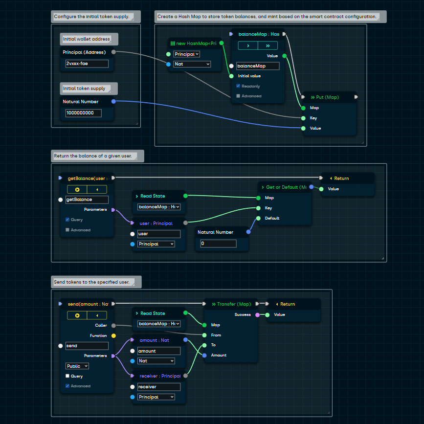

---

> *Blocks* is an online visual smart contract builder for the [Internet Computer](https://dfinity.org/).

### [Homepage](https://blocks-editor.github.io) / [Web Application](https://blocks-editor.github.io/blocks) / [Discord Community](https://discord.gg/jDDWtKwWQf)



---

## Embedded Mode

Customize the Blocks Editor for your React application using the [react-blocks-editor](https://www.npmjs.com/package/react-blocks-editor) npm package.

## Contributions

PRs are welcome! If you are looking for ideas on how to contribute, please check out the currently open [issues](https://github.com/Blocks-Editor/blocks/issues) and feel free to request clarification about anything that catches your interest. 

## Local Environment

```sh
git clone https://github.com/Blocks-Editor/blocks
cd blocks
npm install
```

### Serve (http://localhost:3000):

```bash
npm start
```

### Test:

```bash
npm test
```

### Build:

```bash
npm run build
```

## Support the Project

*Blocks* is a 100% open-source IC community project.
Please donate to help keep the application running.

- ICP: `184d1794cba6d6384e8487c702436eee7614aeb17cbfc94fcfa328b3f7bf7f75`
- ETH: `0xE977fa3a79fC45eB7c2C628d7D7De65483Cd0751`
- BTC: `3QpW3YxLBEvBpNn8PP53kvHXRktvKafu4w`
- USDT: `0x5274c12Fe17E00276D2cd1FB0aeb5eb9868E006f`
- USDC: `0x0b00230c684cCf1220bDD82970240F5e5E9b3f1C`

---

This project was made possible via the [DFINITY Developer Grant Program](https://dfinity.org/grants/).
