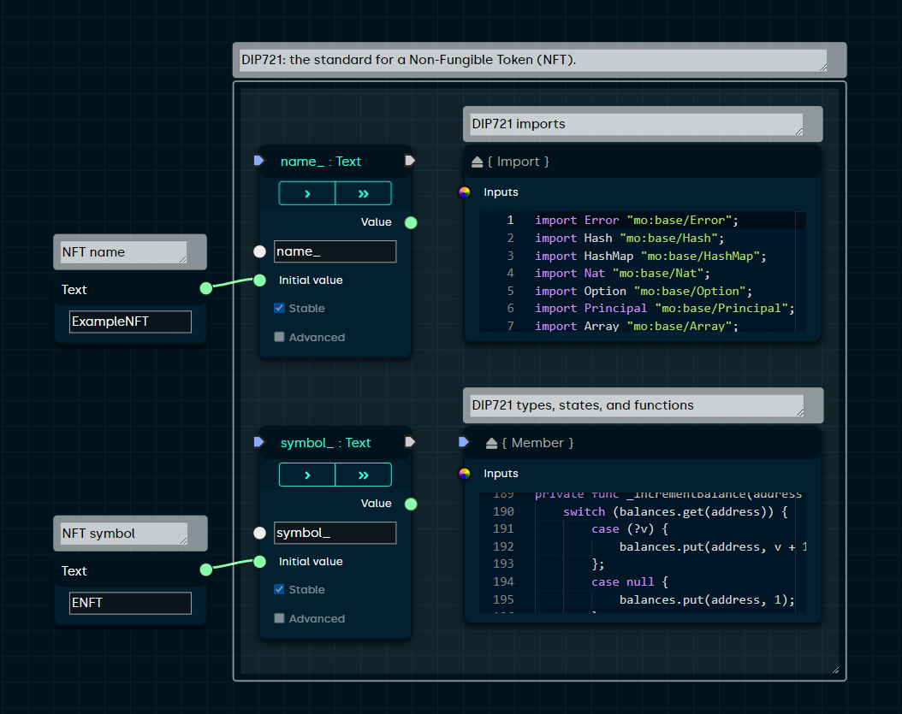

[](https://blocks-editor.github.io/blocks/)

---

> *Blocks* is an online visual smart contract builder for the [Internet Computer](https://dfinity.org/).

### [Homepage](https://blocks-editor.github.io) / [Web Application](https://blocks-editor.github.io/blocks) / [Twitter](https://twitter.com/BlocksEditor) / [Discord](https://discord.gg/jDDWtKwWQf)

---


> Inspired by low-code editors such as [Blender Nodes](https://docs.blender.org/manual/en/latest/compositing/introduction.html) and [Unreal Engine Blueprint](https://docs.unrealengine.com/4.27/en-US/ProgrammingAndScripting/Blueprints/), the Blocks Editor makes it possible to build [Motoko smart contracts](https://smartcontracts.org/docs/language-guide/motoko.html) using a simple drag-and-drop interface.

## Getting Started

Here are a few tips for learning the Blocks user interface:

- Complete the [interactive tutorials](https://blocks-editor.github.io/blocks/?menu=tutorials) to learn the basic editor workflow.
- Browse a variety of [examples and templates](https://blocks-editor.github.io/blocks/?menu=load) available in the application.
- Select a block and press 'Q' on your keyboard to view the corresponding [Quick Reference](https://blocks-editor.github.io/blocks/?menu=reference) information. 
- Try hovering your mouse over a block name, connection socket, or input field to view a tooltip with more context.
- Open the 'Compile' panel and press 'Build & Run' to compile, deploy and test your code on the Internet Computer. 
- If you're running into an issue or have any questions, feel free to ask our [Discord community](https://discord.gg/jDDWtKwWQf)!

---



> Combine visual logic with Motoko language syntax using custom Expression blocks. 

## Advanced Usage

- Customize the editor and view keyboard shortcuts for common block types in the [Options](https://blocks-editor.github.io/blocks/?menu=settings) menu.
- Hold 'Ctrl' or 'Cmd' when opening the right-click placement menu to view and search all blocks available in the editor. 
- Quickly remove connections by holding the 'Ctrl' or 'Cmd' key and clicking on a connection socket.
- Add a GitHub library using a `Package` block, import a file using an `Import` block, and call a library function using an expression block such as `{ Expression }` or `{ Statement }`.
- Convert a standard Motoko file to a Blocks smart contract using the `{ Import }` and `{ Member }` block (view the [DIP721 NFT template](https://blocks-editor.github.io/blocks/?menu=load) for an example).
- Add test cases to ensure your smart contract works as intended.

## Embedded Mode

Customize the Blocks Editor for your React application using the [react-blocks-editor](https://www.npmjs.com/package/react-blocks-editor) npm package.

## Contributions

PRs are welcome! If you are looking for ideas on how to contribute, please check out the currently open [issues](https://github.com/Blocks-Editor/blocks/issues) and feel free to request clarification about anything that catches your interest. 

## Local Environment

```sh
git clone https://github.com/Blocks-Editor/blocks
cd blocks
npm install
```

### Serve (http://localhost:3000):

```bash
npm start
```

### Test:

```bash
npm test
```

### Build:

```bash
npm run build
```

## Support the Project

*Blocks* is a 100% open-source IC community project.
Please donate to help keep the application running.

- **ICP**: `184d1794cba6d6384e8487c702436eee7614aeb17cbfc94fcfa328b3f7bf7f75`
- **ETH**: `0xE977fa3a79fC45eB7c2C628d7D7De65483Cd0751`
- **BTC**: `3QpW3YxLBEvBpNn8PP53kvHXRktvKafu4w`

---

This project was made possible via the [DFINITY Developer Grant Program](https://dfinity.org/grants/).
